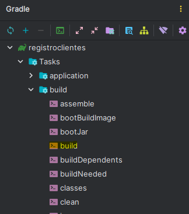
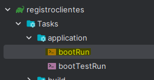
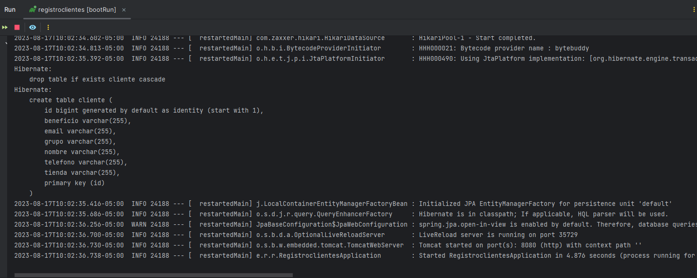
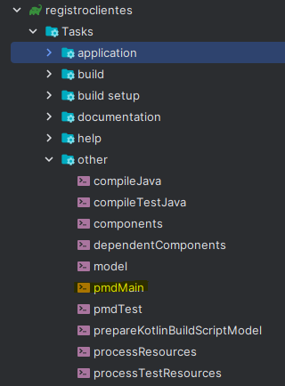
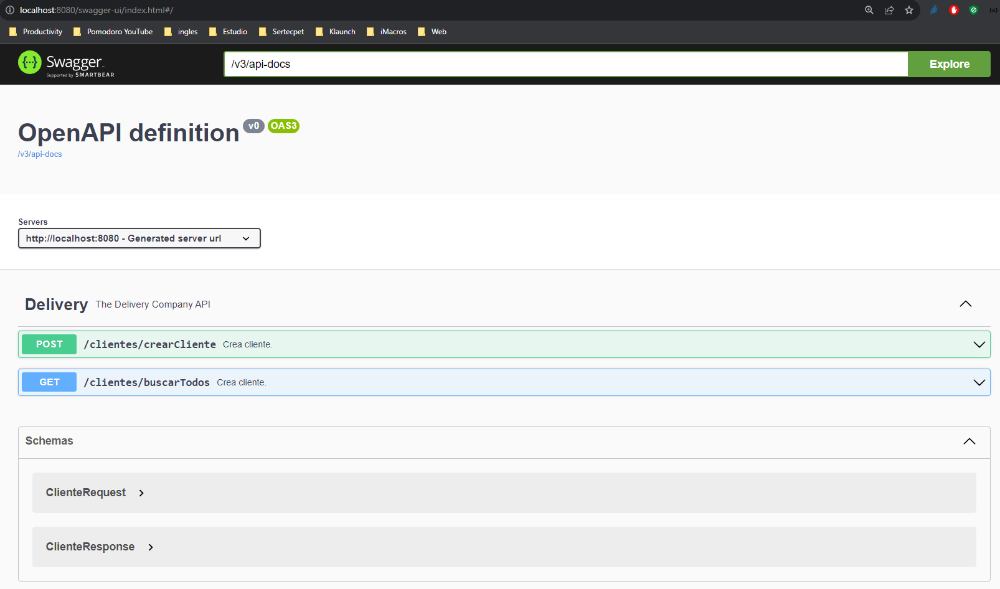
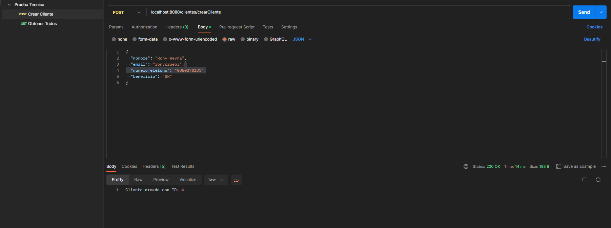
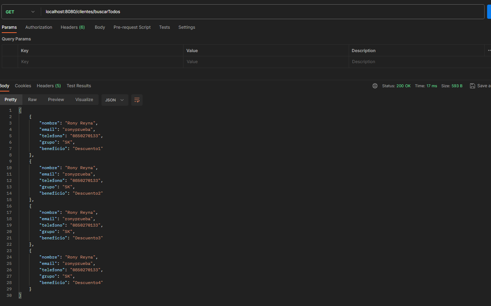

# Tecnologias usadas

* Java 17
* Spring Boot 3.1.2
* Lombok
* Swagger
* PMD
* Gradle

## Despliegue 

El sistema fue desarrollado en el IDE Intellij, para su despliegue basta con clonar el proyecto, compilar y ejecutar por medio de las herramientas de gradle integradas en el IDE

Obteniendo un despliegue adecuado

Para verificar las reglas de PMD (herramienta de calidad de código encargada de validar los estándares de construcción de un desarrollo), se puede usar la opción pmdMain

Para ingresar a Swagger una ves ejecutada el app se lo puede hacer por medio de link http://localhost:8080/swagger-ui/index.html#/Delivery/crearCliente_1

De igual manera adjunto la collección de postman que use para probar el correcto funcionamiento del app 

[Prueba Tecnica.postman_collection.json](Prueba%20Tecnica.postman_collection.json)

 
